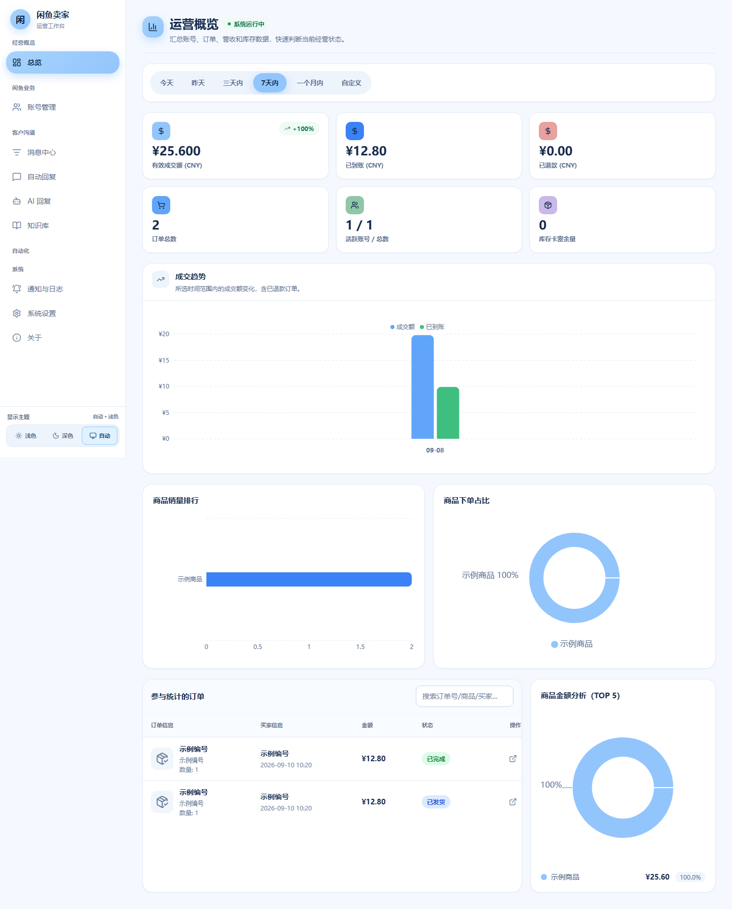

# 闲鱼卖家

一个面向闲鱼卖家的本地运营工作台，当前版本 `1.1.0`。项目的核心方向是：让 AI 根据商品知识和账号配置，自动参与买家聊天，减少重复回复和人工盯盘。本项目删除自动发货功能，**提高稳定性，减少风控。**

如需自动发货，建议使用阿奇索负责发货，本项目专注自动 AI 聊天，用来补充阿奇索暂未覆盖的自动聊天能力。

> 本项目 fork 自 [23Star/xianyu-super-butler](https://github.com/23Star/xianyu-super-butler)，仅用于保留直接来源说明。

## 前端功能

前端是一个 React + TypeScript 的卖家控制台，登录后从左侧导航进入各项功能：

- **AI 回复**：为不同闲鱼账号配置 OpenAI 兼容模型、回复风格、上下文和启停状态，并可在页面内测试回复效果。
- **知识库**：维护商品事实、来源、业务规则和问答内容；支持上传 UTF-8 编码的 Markdown/TXT 文档，预览后按章节导入，并在知识库问答中显示本次提供给 AI 的依据。
- **消息中心**：查看买家会话、读取聊天记录并进行人工补充回复；适合处理 AI 不确定或需要人工确认的消息。
- **账号管理**：扫码登录、Cookie 恢复、连接状态、风控状态和账号级 AI 配置集中管理；遇到滑块验证时自动尝试处理，仅在取得有效验证 Cookie 后更新会话，失败时提示人工处理。
- **商品管理**：同步商品并查看商品状态，作为 AI 理解商品信息和参与买家聊天的基础。
- **订单管理**：查看订单和同步交易状态；自动发货由阿奇索负责，本项目不执行自动发货动作。
- **总览与通知**：通过经营数据、运行日志和通知快速了解账号、消息、订单及任务状态；系统日志支持按时间、级别和来源筛选、分批加载、30 秒自动刷新及手动清空，并自动保留最近 7 天记录。
- **系统设置**：按需启用或关闭商品、订单、AI 回复、知识库、消息等功能，并配置公告和部署参数。

### 前端主要页面



## 快速开始

需要 Docker 和 Docker Compose：

```bash
git clone https://github.com/adzcsx2/xianyu-seller.git
cd xianyu-seller
cp .env.example .env
docker compose up -d --build
```

启动后访问 <http://localhost:8080/>。首次使用建议先在 `.env` 中启用登录并修改管理员密码，再添加闲鱼账号和 AI 模型配置。

国内网络环境可以使用：

```bash
docker compose -f docker-compose-cn.yml up -d --build
```

NAS 或不希望本机构建时，使用：

```bash
docker compose -f docker-compose.nas.yml up -d
```

源码运行需要 Python 3.11+、Node.js 20+、npm 和 Chromium：

```powershell
py -3.11 -m venv .venv
.\.venv\Scripts\Activate.ps1
python -m pip install -r requirements.txt
playwright install chromium
Set-Location frontend
npm ci
npm run build
Set-Location ..
python Start.py
```

## 使用建议

1. 在「账号管理」登录并确认闲鱼账号处于在线状态。
2. 在「知识库」录入商品事实、价格、售后规则和常见问答。
3. 在「AI 回复」为账号配置可信的模型服务，并先使用测试功能确认回复风格。
4. 在「消息中心」观察实际聊天效果，必要时切换人工回复。
5. 如需自动发货，请在阿奇索中配置；本项目只负责自动 AI 聊天，不执行自动发货。

自动回复、账号操作和平台交互可能触发平台风控。请先使用测试账号验证，并妥善保管 Cookie、Token、聊天记录和订单等私密数据。

## 问题反馈

使用中有问题、发现缺陷或有功能建议，请提交 [Issue](https://github.com/adzcsx2/xianyu-seller/issues)，并尽量附上复现步骤、运行环境和脱敏后的日志。请不要在 Issue 中提交密码、Cookie、Token、二维码、订单或聊天记录。

## 文档与许可证

- [文档索引](docs/README.md)
- [项目概览](docs/guide/PROJECT_OVERVIEW.md)
- [部署与排查](docs/deployment.md)
- [自动化测试指南](docs/guide/自动化测试指南.md)

本项目使用 [GNU Affero General Public License v3.0](LICENSE)。修改、部署或通过网络向用户提供服务时，请遵守 AGPL-3.0 的相关义务。
